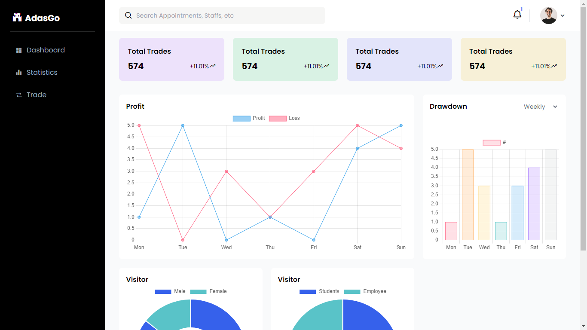

## Adasgo (0.0.0) ✨

Adasgo is an admin dashboard template created using HTML, Tailwind CSS, and Javascript. This template is public and can be used by anyone.




### How to use

To run this project

```bash
git clone https://github.com/FigoArbiansyah/adasgo.git
```

```bash
cd adasgo
```

```bash
npm install
```

```bash
npx tailwindcss -i ./src/input.css -o ./dist/css/output.css --watch
```
